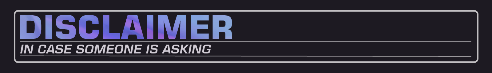
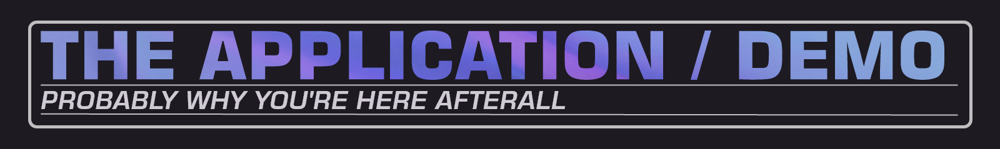
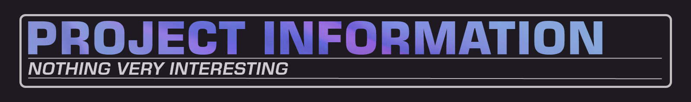

<!--ts-->
* [Disclaimer](#disclaimer)
* [The app in itself / demos](#demos)
* [Project information](#project-information)
<!--te-->

This project has originally been made in mid-January 2025 (in like 2/3 days). I simply woke up one day and decided to "remaster" it. 
The only purpose of it is to keep a "trace" to something I learnt for fun.

I wanted to get out of my "comfort place" (desktop-based systems) and discover new stuff, and the PlayStation3 was for me a funny thing to try. Learning its constraints, workspace, tools, ... 
What I made is an extremely primitive approach to <i>PSGL</i> and the <i>PlayStation3</i> in itself. So there's no usage of SPU/SPURS (I'll probably do that shit when I'll get my hands into GCM, you know, for fun).

<strong>I'm (obviously) not able to provide the <i>SDKs</i>, <i>toolchains</i> or <i>compilers</i> used.</strong>

The application itself is very, very simple.
A simple grey background, a triangle in the center and a color for each Vertex that blends in between
(the starting point of everything I guess).

//TODO: MP4 
//TODO: PKG SCREENSHOT

<table>
    <tr>
        <td>Platform Toolset</td>
        <td>PPU SNC</td>
    </tr>
    <tr>
        <td>Output</td>
        <td>*.ppu.self (Fake Signed ELF)</td>
    </tr>
    <tr>
        <td>C++ Language</td>
        <td>C++ 11</td>
    </tr>
</table>

This project was developed and compiled on Windows 11 using 
JetBrains Rider 2024.3.3 and Visual Studio 2013 ULTIMATE. 
Tested on a <i>PlayStation(R)3 DEX 4.92.2</i>.

